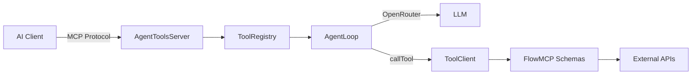

[]() 

# mcp-agent-server

MCP Server with agent-powered tools, mountable as Express middleware. Each tool starts an LLM Agent Loop that iteratively calls FlowMCP schema tools to solve problems.

## Architecture



## Quickstart

```bash
git clone https://github.com/flowmcp/mcp-agent-server.git
cd mcp-agent-server
npm i
```

```javascript
import express from 'express'
import { AgentToolsServer } from 'mcp-agent-server'

const app = express()
app.use( express.json() )

const server = await AgentToolsServer.create( {
    name: 'My Agent Server',
    version: '1.0.0',
    routePath: '/mcp',
    llm: {
        baseURL: 'https://openrouter.ai/api',
        apiKey: process.env.OPENROUTER_API_KEY
    },
    tools: [
        {
            name: 'defi-research',
            description: 'Research DeFi protocols',
            inputSchema: {
                type: 'object',
                properties: {
                    query: { type: 'string' }
                },
                required: [ 'query' ]
            },
            agent: {
                systemPrompt: 'You are a DeFi research agent.',
                model: 'anthropic/claude-sonnet-4-5-20250929',
                maxRounds: 10,
                maxTokens: 4096
            },
            toolSources: [
                {
                    type: 'flowmcp',
                    schemas: [ defilamaSchema, coingeckoSchema ],
                    serverParams: { DEFILAMA_KEY: process.env.DEFILAMA_KEY }
                }
            ],
            execution: {
                taskSupport: 'optional'
            }
        }
    ]
} )

app.use( server.middleware() )
app.listen( 4100 )
```

## Features

- MCP Server with StreamableHTTP transport (session-based)
- LLM Agent Loop with iterative tool calling via Anthropic SDK
- FlowMCP schemas as tool sources (in-process, no external server needed)
- Configurable answer schema per tool
- MCP Tasks API for async tool execution
- Composable with `x402-mcp-middleware` for payment gating
- Multiple tool sources per tool via CompositeToolClient

## Table of Contents

- [Quickstart](#quickstart)
- [Architecture](#architecture)
- [Methods](#methods)
  - [AgentToolsServer.create()](#agenttoolsservercreate)
  - [.middleware()](#middleware)
  - [.listToolDefinitions()](#listtooldefinitions)
- [Tool Configuration](#tool-configuration)
- [Composition with x402](#composition-with-x402)
- [License](#license)

## Methods

### `AgentToolsServer.create()`

Creates a new server instance from configuration.

**Method**

```
AgentToolsServer.create( { name, version, routePath, llm, tools, tasks } )
```

| Key | Type | Description | Required |
|-----|------|-------------|----------|
| name | string | Server name for MCP handshake | Yes |
| version | string | Server version | Yes |
| routePath | string | Express route path. Default `'/mcp'` | No |
| llm | object | LLM config `{ baseURL, apiKey }` | Yes |
| tools | array | Array of tool configurations | Yes |
| tasks | object | Task store config `{ store }`. Default `InMemoryTaskStore` | No |

**Returns**

```javascript
// AgentToolsServer instance
const server = await AgentToolsServer.create( { /* config */ } )
```

### `.middleware()`

Returns an Express middleware function that handles MCP protocol requests (POST/GET/DELETE) on the configured route path.

**Method**

```
server.middleware()
```

**Returns**

```javascript
// Express middleware function (req, res, next) => Promise<void>
app.use( server.middleware() )
```

### `.listToolDefinitions()`

Returns all registered tools in MCP ListTools format.

**Method**

```
server.listToolDefinitions()
```

**Returns**

```javascript
const { tools } = server.listToolDefinitions()
// tools: [ { name, description, inputSchema, execution? } ]
```

| Key | Type | Description |
|-----|------|-------------|
| tools | array | Array of tool definitions in MCP format |

## Tool Configuration

Each tool in the `tools` array has the following structure:

| Key | Type | Description | Required |
|-----|------|-------------|----------|
| name | string | Tool name (used in MCP protocol) | Yes |
| description | string | Tool description | Yes |
| inputSchema | object | JSON Schema for tool input | Yes |
| agent | object | Agent configuration (see below) | Yes |
| toolSources | array | Array of tool source configs (see below) | Yes |
| execution | object | `{ taskSupport: 'optional' \| 'required' }` | No |

### Agent Configuration

| Key | Type | Description | Required |
|-----|------|-------------|----------|
| systemPrompt | string | System prompt for the LLM | Yes |
| model | string | LLM model ID (e.g. `'anthropic/claude-sonnet-4-5-20250929'`) | Yes |
| maxRounds | number | Maximum agent iterations. Default `10` | No |
| maxTokens | number | Max completion tokens. Default `4096` | No |
| answerSchema | object | Custom JSON Schema for `submit_answer` tool | No |

### Tool Sources

Each entry in `toolSources` defines where the agent gets its tools from:

| Key | Type | Description | Required |
|-----|------|-------------|----------|
| type | string | Source type. Currently `'flowmcp'` | Yes |
| schemas | array | FlowMCP schema objects | Yes |
| serverParams | object | Environment variables / API keys for schemas | No |

## Composition with x402

No code coupling. Pure Express middleware ordering:

```javascript
import express from 'express'
import { X402Middleware } from 'x402-mcp-middleware/v2'
import { AgentToolsServer } from 'mcp-agent-server'

const app = express()
app.use( express.json() )

// 1. Payment gate (optional)
const x402 = await X402Middleware.create( { /* config */ } )
app.use( x402.mcp() )

// 2. Agent MCP Server
const agent = await AgentToolsServer.create( { /* config */ } )
app.use( agent.middleware() )

app.listen( 4100 )
```

## License

MIT

## Contributing

PRs are welcome. Please open an issue first to discuss proposed changes.
